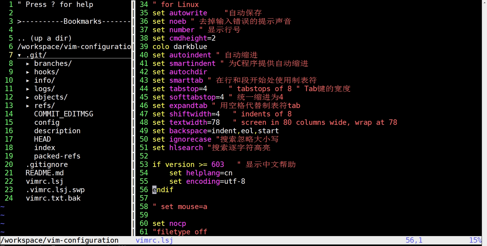

# my-vim-configuration

<p float="center">
  
</p>

## Requirements
* install vim 8.0+
* ``` tar zxf v8.2.5046.zip && cd vim-8.2.5046 ```
* ``` ./configure --with-features=huge --enable-pythoninterp=yes --enable-cscope --enable-fontset --with-python-config-dir=/usr/lib64/python2.7/config --enable-python3interp=yes --with-python3-config-dir=/usr/lib64/python3.6/config-3.6m-x86_64-linux-gnu --with-python3-command=/usr/bin/python3 --enable-multibyte ```

## Usage
* install vim v8.0 directly or tar zxf v8.0.0134
* cp -fr vim.lsj ~/.vim
* cp vimrc.lsj ~/.vimrc
* git clone https://github.com/VundleVim/Vundle.vim.git ~/.vim/bundle/Vundle.vim
* start vim and run ```:PluginInstall```

## Check Status
* ```vim --version | grep clip*```   
* if clipboard and xterm_clipboard is supported with '+', then system
clipboard could be work, or you may be install vim with follows:   
* sudo apt-get install vim vim-scripts vim-gtk vim-gnome

## Deps
* nerdtree https://github.com/scrooloose/nerdtree.git
* cpp autocomplete, need to download the cpp_src to vim and ctags the src, details to see http://blog.csdn.net/doc_sgl/article/details/47205779
* YouCompleteMe: details to see https://github.com/Valloric/YouCompleteMe.git
* ctrlp: https://github.com/ctrlpvim/ctrlp.vim, Full path fuzzy file, buffer, mru, tag, ... finder for Vim
